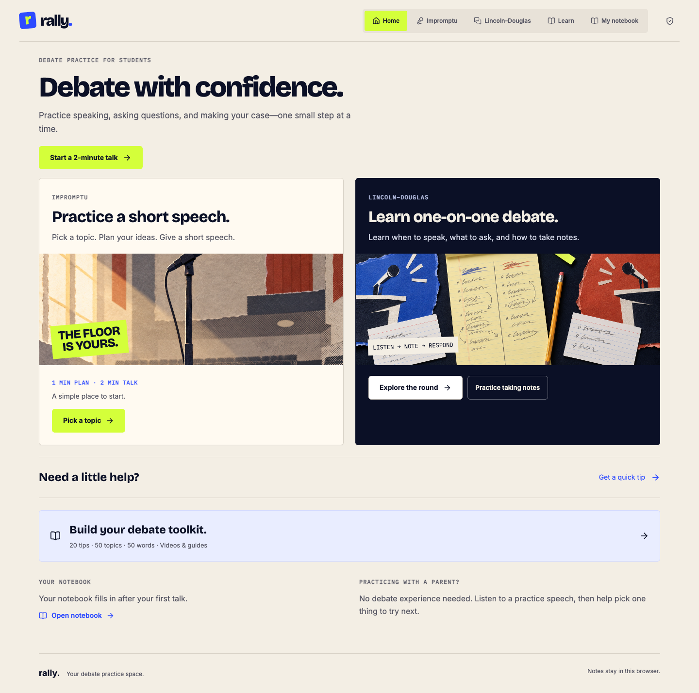

# Rally

**Debate with confidence.** Free practice tools for middle and high school students.

[Open Rally](https://rally.ryanseamons.com/) · [About the project](https://ryanseamons.com/projects/rally/)



## Practice a little. Get more confident.

- **Impromptu:** choose a topic, plan four ideas, practice with a timer, and reflect.
- **Lincoln–Douglas:** explore the round, listen to seven examples, practice questions, and learn to take notes.
- **Learn:** 20 tips, 50 themes, 50 debate terms, and linked videos and guides.
- **Notebook:** save reflections in your browser; download and restore backups without replacing existing notes.

I built Rally for my son when he started debate. He tried it and liked it, so I made it public for other students and families.

## Your practice stays yours

No account or API key is needed. Notebook entries stay in your browser. Optional speech recordings stay in the tab unless you download them. There is no automatic AI judge. The example readings are prerecorded AI voices.

Notes do not sync between browsers or web addresses. The notebook includes a guide for exporting notes from the original Rally site using a bookmark. Clearing browser data removes local notes, so download a backup first.

## Run locally

Requires Node.js 22.12+.

```sh
npm ci
npm run dev
```

Open the localhost address printed by Vite. To check and build:

```sh
npm test
npm run test:browser
npm run build
```

Browser tests expect the dev server at port 5173 and Google Chrome installed. Production output is in `dist/`.

## Code map

- `src/Rally.js`: recovered application content and React components.
- `src/ui-runtime.js`: UI primitives backed by Motion, Radix, and Lucide.
- `src/NotebookBackup.jsx` and `src/notebook-storage.mjs`: backup UI, validation, and safe merging.
- `src/styles.css`: original design and responsive styles.
- `public/`: local illustrations, fonts, prerecorded audio, and migration guide.
- `docs/HOSTING.md`: Cloudflare Pages deployment and domain setup.

This is a recovery of the owner's public app, not the missing original TypeScript checkout. See [RECOVERY.md](RECOVERY.md) for provenance and limitations. No private notebook data or service credentials are included.

## License

Application code is MIT licensed. Third-party software and fonts retain their own licenses. See [THIRD_PARTY_NOTICES.md](THIRD_PARTY_NOTICES.md). Illustrations and prerecorded audio are included for use with Rally.

Made by [Ryan Seamons](https://ryanseamons.com/).
